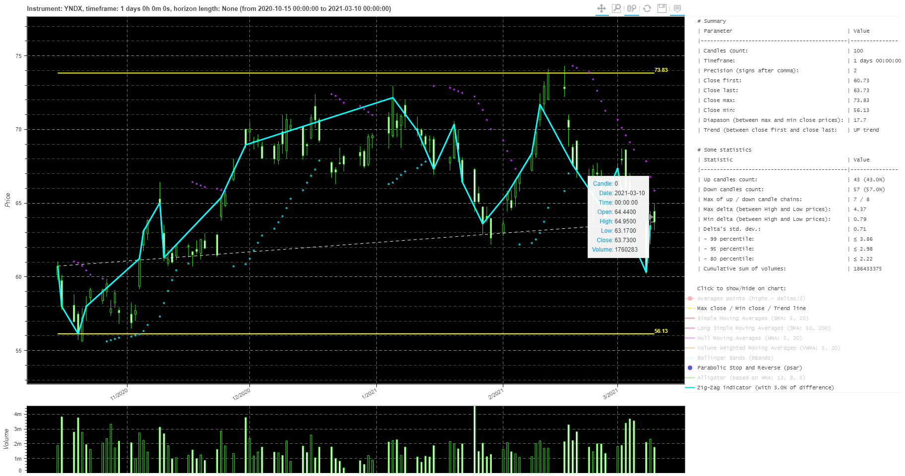

# AVStockParser

[](https://travis-ci.com/Tim55667757/AVStockParser)
[](https://pypi.python.org/pypi/AVStockParser)
[](https://github.com/Tim55667757/AVStockParser/blob/master/LICENSE)

All traders sometimes need to get historical data of stocks for further price analysis and charting. Most often this data is supplied for paid or you must spend a lot of time manually uploading data from special sites.

But there are many online services that provide APIs to get stock price data automatically. One of this service is Alpha Vantage. The main data source for this service is the NASDAQ exchange. Detailed documentation on working with Alpha Vantage API here: https://www.alphavantage.co/documentation/

**AVStockParser** is a simple library that can be use as python module or console CLI program. AVStockParser request time series with stock history data in .json-format from www.alphavantage.co and convert into Pandas dataframe or .csv file with OHLCV-candlestick in every strings. You will get a table that contains columns of data in the following sequence: "date", "time", "open", "high", "low", "close", "volume". One line is a set of data for plotting one candlestick. In addition, you can draw simple interactive chart of candlesticks.

See russian readme here (инструкция на русском здесь): https://github.com/Tim55667757/AVStockParser/blob/master/README_RU.md


## Setup

The easiest way is to install via PyPI:
```commandline
pip install avstockparser
```

After that, you can check the installation with the command:
```commandline
pip show avstockparser
```


## Auth

Alpha Vantage service use authentication with api key. Request free api key at this page: https://www.alphavantage.co/support/#api-key

Api key is a alphanumeric string token. You must send token with every request to server. When you work with AVStockParser just use this flag `--api-key "your token here"` or set apiKey variable for method `AVParseToPD(apiKey="your token here"`.


## Usage examples

### From the command line

Get help:
```commandline
avstockparser --help
```

Output:
```
usage: python AVStockParser.py [some options] [one command]

Alpha Vantage data parser. Get, parse, and save stock history as .csv-file or
Pandas dataframe. See examples: https://tim55667757.github.io/AVStockParser

optional arguments:
  -h, --help            show this help message and exit
  --api-key API_KEY     Option (required): Alpha Vantage service's api key.
                        Request free api key at this page:
                        https://www.alphavantage.co/support/#api-key
  --ticker TICKER       Option (required): stock ticker, e.g., 'GOOGL' or
                        'YNDX'.
  --output OUTPUT       Option: full path to .csv output file. Default is None
                        mean that function return only Pandas dataframe.
  --period PERIOD       Option: values can be 'TIME_SERIES_INTRADAY',
                        'TIME_SERIES_DAILY', 'TIME_SERIES_WEEKLY',
                        'TIME_SERIES_MONTHLY'. Default: 'TIME_SERIES_INTRADAY'
                        means that api returns intraday stock history data
                        with pre-define interval. More examples:
                        https://www.alphavantage.co/documentation/
  --interval INTERVAL   Option: '1min', '5min', '15min', '30min' or '60min'.
                        This is intraday period used only with
                        --period='TIME_SERIES_INTRADAY' key. Default: '60min'
                        means that api returns stock history with 60 min
                        interval.
  --size SIZE           Option: how many last candles returns for history.
                        Values can be 'full' or 'compact'. This parameter used
                        for 'outputsize' AV api parameter. Default: 'compact'
                        means that api returns only 100 values of stock
                        history data.
  --retry RETRY         Option: number of connections retry for data request
                        before raise exception. Default is 3.
  --debug-level DEBUG_LEVEL
                        Option: showing STDOUT messages of minimal debug
                        level, e.g., 10 = DEBUG, 20 = INFO, 30 = WARNING, 40 =
                        ERROR, 50 = CRITICAL.
  --parse               Command: get, parse, and save stock history as Pandas
                        dataframe or .csv-file if --output key is defined.
  --render              Command: use PriceGenerator module to render
                        interactive chart from parsed data. This key only used
                        with --parse key.
```

Let us try to get daily candlesticks of YNDX stock into file YNDX1440.csv. The command may be like this:
```commandline
avstockparser --debug-level 10 --api-key "your token here" --ticker YNDX --period TIME_SERIES_DAILY --size full --output YNDX1440.csv --parse
```

If successful, you should get a log output like the following:
```
AVStockParser.py    L:184  DEBUG   [2020-12-25 01:03:13,459] Alpha Vantage data parser started: 2020-12-25 01:03:13
AVStockParser.py    L:51   DEBUG   [2020-12-25 01:03:13,459] Request to Alpha Vantage: [https://www.alphavantage.co/query?function=TIME_SERIES_DAILY&symbol=YNDX&outputsize=full&apikey=***]
AVStockParser.py    L:55   DEBUG   [2020-12-25 01:03:13,459] Trying (1) to send request...
AVStockParser.py    L:119  INFO    [2020-12-25 01:03:15,013] It was received 2415 candlesticks data from Alpha Vantage service
AVStockParser.py    L:120  INFO    [2020-12-25 01:03:15,013] Showing last 3 rows with Time Zone: 'US/Eastern':
AVStockParser.py    L:123  INFO    [2020-12-25 01:03:15,018]             date   time     open     high      low    close   volume
AVStockParser.py    L:123  INFO    [2020-12-25 01:03:15,018] 2412  2020.12.22  00:00  67.2800  67.4400  66.3000  67.1100  1002761
AVStockParser.py    L:123  INFO    [2020-12-25 01:03:15,018] 2413  2020.12.23  00:00  67.7300  68.7700  67.6400  67.6900   822039
AVStockParser.py    L:123  INFO    [2020-12-25 01:03:15,018] 2414  2020.12.24  00:00  68.1800  68.2900  67.1700  67.6500   359133
AVStockParser.py    L:127  INFO    [2020-12-25 01:03:15,027] Stock history saved to .csv-formatted file [./YNDX1440.csv]
AVStockParser.py    L:229  DEBUG   [2020-12-25 01:03:15,027] All Alpha Vantage data parser operations are finished success (summary code is 0).
AVStockParser.py    L:234  DEBUG   [2020-12-25 01:03:15,028] Alpha Vantage data parser work duration: 0:00:01.568581
AVStockParser.py    L:235  DEBUG   [2020-12-25 01:03:15,028] Alpha Vantage data parser finished: 2020-12-25 01:03:15
```

For key `--period` you can use values: `TIME_SERIES_DAILY`, `TIME_SERIES_WEEKLY` and `TIME_SERIES_MONTHLY` to get daily, weekly, and monthly candlesticks. Default is `TIME_SERIES_INTRADAY`.

In another example let us try to get intraday hourly candlesticks of MMM stock into file MMM60.csv. The command may be like this:
```commandline
avstockparser --debug-level 10 --api-key "your token here" --ticker MMM --period TIME_SERIES_INTRADAY --interval 60min --size compact --output MMM60.csv --parse
```

If successful, you will receive something like this output:
```
AVStockParser.py    L:184  DEBUG   [2020-12-25 01:09:44,601] Alpha Vantage data parser started: 2020-12-25 01:09:44
AVStockParser.py    L:51   DEBUG   [2020-12-25 01:09:44,601] Request to Alpha Vantage: [https://www.alphavantage.co/query?function=TIME_SERIES_INTRADAY&symbol=MMM&interval=60min&outputsize=compact&apikey=***]
AVStockParser.py    L:55   DEBUG   [2020-12-25 01:09:44,601] Trying (1) to send request...
AVStockParser.py    L:119  INFO    [2020-12-25 01:09:45,542] It was received 100 candlesticks data from Alpha Vantage service
AVStockParser.py    L:120  INFO    [2020-12-25 01:09:45,542] Showing last 3 rows with Time Zone: 'US/Eastern':
AVStockParser.py    L:123  INFO    [2020-12-25 01:09:45,551]           date   time      open      high       low     close  volume
AVStockParser.py    L:123  INFO    [2020-12-25 01:09:45,551] 97  2020.12.23  16:00  174.5700  175.0200  173.9550  174.0200  332340
AVStockParser.py    L:123  INFO    [2020-12-25 01:09:45,551] 98  2020.12.23  17:00  173.9900  173.9900  173.9600  173.9600  316682
AVStockParser.py    L:123  INFO    [2020-12-25 01:09:45,551] 99  2020.12.23  18:00  173.9900  173.9900  173.9900  173.9900    1410
AVStockParser.py    L:127  INFO    [2020-12-25 01:09:45,555] Stock history saved to .csv-formatted file [./MMM60.csv]
AVStockParser.py    L:229  DEBUG   [2020-12-25 01:09:45,555] All Alpha Vantage data parser operations are finished success (summary code is 0).
AVStockParser.py    L:234  DEBUG   [2020-12-25 01:09:45,555] Alpha Vantage data parser work duration: 0:00:00.953904
AVStockParser.py    L:235  DEBUG   [2020-12-25 01:09:45,555] Alpha Vantage data parser finished: 2020-12-25 01:09:45
```

The file ./MMM60.csv will be completely similar and include the same columns but with hourly data: "date", "time", "open", "high", "low", "close", "volume":
```
2020.12.11,09:00,171.9100,171.9100,171.5500,171.8300,1663
2020.12.11,10:00,172.0100,173.6800,172.0100,173.5900,214065
2020.12.11,11:00,173.5800,173.9770,172.6700,173.0800,268294
...
2020.12.23,16:00,174.5700,175.0200,173.9550,174.0200,332340
2020.12.23,17:00,173.9900,173.9900,173.9600,173.9600,316682
2020.12.23,18:00,173.9900,173.9900,173.9900,173.9900,1410
```

Key `--size` may be `full` (Alpha Vantage service return a lot of history candles) or `compact` (only last 100 candles).

Key `--interval` use only with `--period TIME_SERIES_INTRADAY`. Intraday intervals of history candles may be only `1min`, `5min`, `15min`, `30min` or `60min`.

Also, you can draw an interactive chart (see: [PriceGenerator](https://github.com/Tim55667757/PriceGenerator) library) using `--render` key after `--parse` key:
```commandline
avstockparser --debug-level 10 --api-key "your token here" --ticker YNDX --period TIME_SERIES_DAILY --size compact --output YNDX1440.csv --parse --render
```

After running the command above, you will get three files:
- `YNDX1440.csv` — .csv-file containing prices (example: [./media/YNDX1440.csv](./media/YNDX1440.csv));
- `index.html` — price chart and statistics drawn using the Bokeh library and saved to an .html-file (example: [./media/index.html](./media/index.html));
- `index.html.md` — statistics as simple text, saved in markdown format (example: [./media/index.html.md](./media/index.html.md)).




### Using import

Let us look only one simple example of requesting history of IBM stock as Pandas dataframe:
```
from avstockparser.AVStockParser import AVParseToPD as Parser

# Requesting historical candles and save the data into a Pandas dataframe variable.
# If the variable output is not specified, the module only returns data in Pandas dataframe format.
df = Parser(
    reqURL=r"https://www.alphavantage.co/query?",
    apiKey="demo",
    output=None,
    ticker="IBM",
    period="TIME_SERIES_INTRADAY",
    interval="5min",
    size="full",
    retry=2,
)
print(df)
```

Output is like this:
```
AVStockParser.py    L:119  INFO    [2020-12-25 01:49:51,612] It was received 2001 candlesticks data from Alpha Vantage service
AVStockParser.py    L:120  INFO    [2020-12-25 01:49:51,612] Showing last 3 rows with Time Zone: 'US/Eastern':
AVStockParser.py    L:123  INFO    [2020-12-25 01:49:51,616]             date   time      open      high       low     close volume
AVStockParser.py    L:123  INFO    [2020-12-25 01:49:51,616] 1998  2020.12.23  17:35  124.1000  124.1000  124.1000  124.1000   1571
AVStockParser.py    L:123  INFO    [2020-12-25 01:49:51,617] 1999  2020.12.23  18:45  124.0500  124.0500  124.0000  124.0000    278
AVStockParser.py    L:123  INFO    [2020-12-25 01:49:51,617] 2000  2020.12.23  20:00  123.9100  123.9100  123.9100  123.9100    225
            date   time      open      high       low     close volume
0     2020.11.25  06:50  124.3500  124.3500  124.2000  124.2000   1218
1     2020.11.25  07:05  124.2000  124.2000  124.2000  124.2000    150
2     2020.11.25  07:10  124.1000  124.1000  124.1000  124.1000    100
3     2020.11.25  07:35  124.0000  124.0000  124.0000  124.0000    510
4     2020.11.25  08:05  123.8201  124.2000  123.8200  123.8200   1414
...          ...    ...       ...       ...       ...       ...    ...
1996  2020.12.23  17:05  123.9100  123.9100  123.9100  123.9100    100
1997  2020.12.23  17:20  123.9000  123.9000  123.9000  123.9000   1146
1998  2020.12.23  17:35  124.1000  124.1000  124.1000  124.1000   1571
1999  2020.12.23  18:45  124.0500  124.0500  124.0000  124.0000    278
2000  2020.12.23  20:00  123.9100  123.9100  123.9100  123.9100    225

[2001 rows x 7 columns]
```


I wish you success in the automation of exchange trading! ;)
